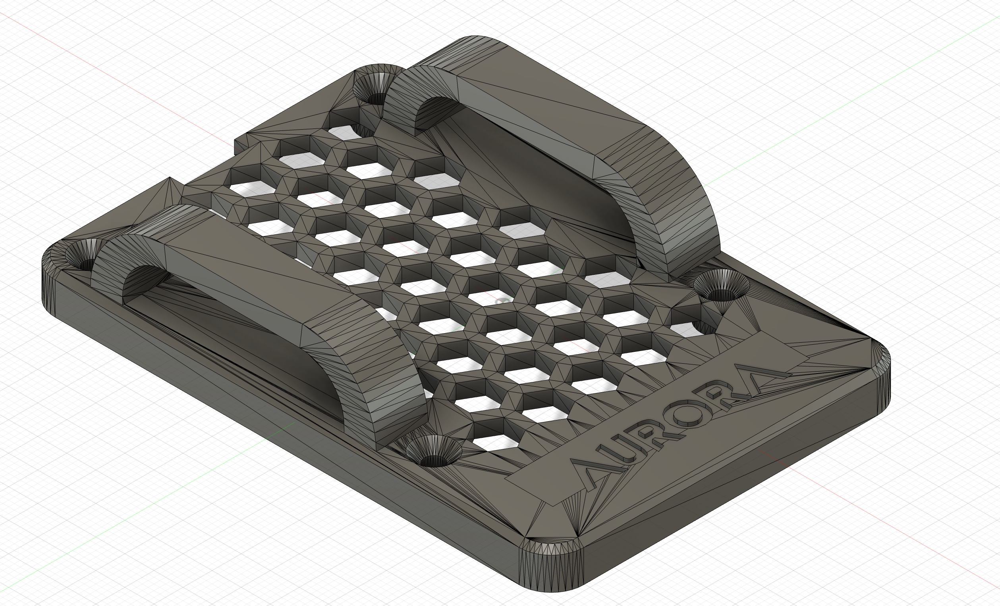
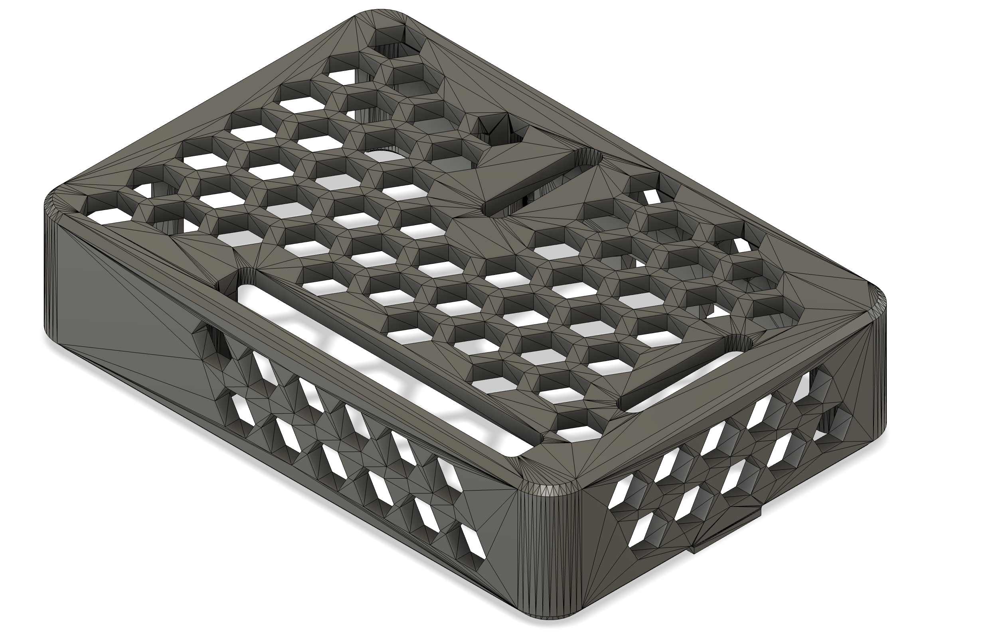
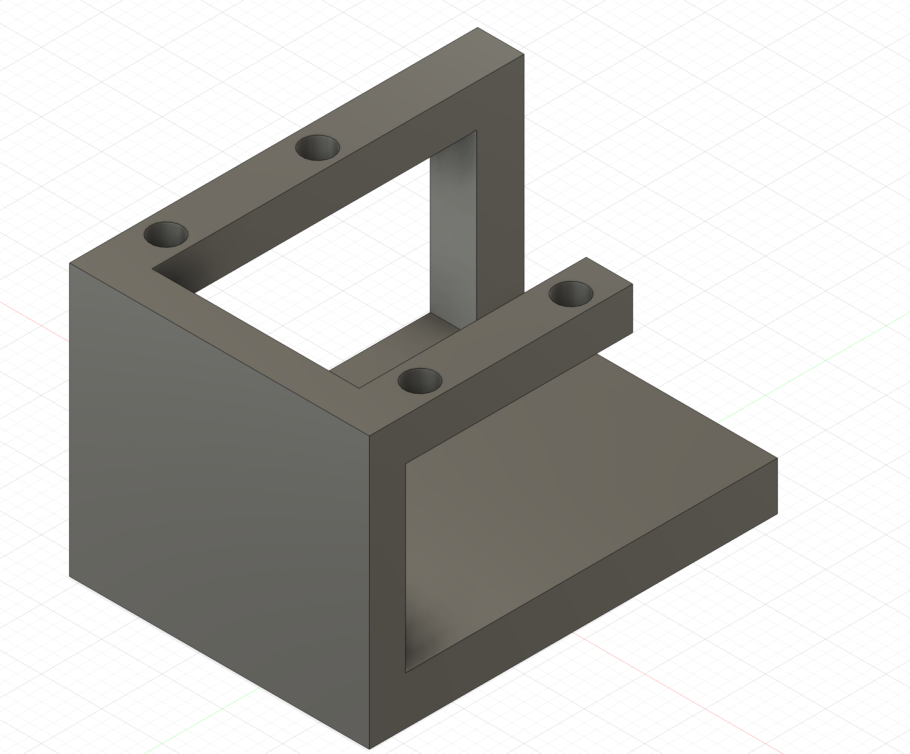

  <h1 style="margin: 0; padding: 0; font-size: 60px !important;">Smart Glasses</h1>
  

Smart glasses are wearable devices that combine traditional eyewear with advanced technology, integrating features like heads-up displays, cameras, microphones, and sensors. They enable users to access information, capture media, and interact with augmented reality or voice assistants seamlessly, all while keeping their hands free. Designed for both everyday and specialized use, smart glasses blend digital functionality with a familiar form factor.

| **Engineer** | **School** | **Area of Interest** | **Grade** |
|:--:|:--:|:--:|:--:|
| Gracin T | Los Gatos High | Electrical Engineering | Incoming Senior

<!-- -->
  
# Final Milestone

<iframe width="560" height="315" src="https://www.youtube.com/embed/4-sfMfNOBuk?si=_V68aqz_k5FXjhHa" title="YouTube video player" frameborder="0" allow="accelerometer; autoplay; clipboard-write; encrypted-media; gyroscope; picture-in-picture; web-share" referrerpolicy="strict-origin-when-cross-origin" allowfullscreen></iframe>

## Accomplishments
Prototype Completion
Gracin achieved a fully functioning mechanical prototype (possibly an engineering project milestone), demonstrating key design elements working together as intended.

Iterative Testing & Refinement
Multiple testing cycles were conducted to identify flaws and implement corrections, showcasing a strong engineering mindset and problem-solving skills.

Effective Team Collaboration
Coordination with mentors and peers was emphasized, with Gracin receiving constructive feedback and integrating it effectively into the project.

Documentation & Presentation
Detailed logs, schematics, and explanatory models were prepared to present the milestone clearly, indicating strong communication and documentation skills.

## Challenges
Mechanical Tolerancing Issues
Precision alignment and tight tolerances caused friction and misalignments—Gracin had to readjust design aspects to accommodate for machining variations.

Material & Component Limitations
Some materials or off-the-shelf parts didn’t meet performance expectations, requiring workarounds or custom fabrication to address unexpected shortcomings.

Time Management Pressure
Balancing testing, redesign, fabrication, and coordination presented scheduling challenges; optimizing workflows became essential to hit project deadlines.

Unanticipated Integration Problems
Bringing together electrical, mechanical, and software components revealed integration issues—motor control feedback loops and sensor connections needed debugging.

# Second Milestone

<iframe width="560" height="315" src="https://www.youtube.com/embed/TG-JziCimy0?si=8_uYgk6106NgsMs9" title="YouTube video player" frameborder="0" allow="accelerometer; autoplay; clipboard-write; encrypted-media; gyroscope; picture-in-picture; web-share" referrerpolicy="strict-origin-when-cross-origin" allowfullscreen></iframe>

## Progress
Since my last update, I’ve made significant technical progress that brings the Smart Glasses closer to being a functional assistive tool. I successfully installed TensorFlow 2 on the Raspberry Pi, which lays the foundation for implementing real-time object detection. I also integrated OCR (Optical Character Recognition) capabilities using adaptive thresholding, which dramatically improved text readability in various lighting conditions—a crucial step for reading signs, labels, or printed documents through the glasses.

## OCR
OCR, or Optical Character Recognition, is the process of converting images of text—such as signs, labels, or documents—into machine-encoded text that can be processed, stored, or read aloud.

### How it works
OCR works by analyzing an image and detecting patterns that resemble characters. The process typically involves several steps:

- Image Preprocessing – This includes converting the image to grayscale and applying thresholding to isolate the text from the background.

- Segmentation – The software identifies and separates lines, words, and characters.

- Feature Extraction – The program extracts distinct features of each character (like curves, lines, and intersections).

- Character Recognition – Using a trained model (often based on machine learning), the software compares extracted features to known characters.

- Post-Processing – Corrects errors based on context, like recognizing "1" instead of "I".

### Binary vs Adaptive Threshold
Thresholding is used to convert grayscale images into binary (black and white) images, which simplifies the text detection process.

Binary Thresholding uses a single global value. Pixels brighter than the threshold become white; darker pixels become black. This works well in consistent lighting but fails when the image has shadows or varying brightness.

Adaptive Thresholding calculates thresholds for small regions of the image. This means different areas of the image can have different threshold values, making it much more effective in uneven lighting conditions—like reading a sign outdoors with shadows.

## OCR Code

  <pre>
  </pre>

## Object Detection Challenges
Developing the object detection code presented several hurdles for me, especially getting it to run smoothly on a Raspberry Pi.

Firstly, real-time performance was a constant battle. Running a deep learning model like MobileNetV2 on such a small device is incredibly demanding. I struggled to get a decent frame rate, even with optimizations like the tflite option. It was a fine line between fast inference and acceptable accuracy, and managing the Pi's limited CPU and memory to prevent crashes or freezes was always on my mind. Making sure the camera stream started and stopped cleanly without hogging resources was also a recurring challenge.

Then there was the Tkinter user interface and video integration. Getting that live camera feed to display without stuttering was tricky. I used root.after to schedule updates, but timing it perfectly with the camera's frame rate and the model's processing time took a lot of tweaking. Plus, I wanted the display to be responsive, so making the video and any overlays (like detection text) scale correctly when the window was resized was a complex task. Adjusting font sizes dynamically based on the window size was a good solution, but getting those calculations just right so the text always fit and was readable required careful attention.

I also spent a lot of time fine-tuning the robustness of the detection logic. Those CONFIDENCE_THRESHOLD and PERSISTANCE_THRESHOLD values were critical. Too low, and I'd get a flurry of false positives; too high, and detections would flicker or be missed entirely. The "persistence" logic helped stabilize things, but finding that sweet spot for PERSISTANCE_THRESHOLD was definitely an iterative process of trial and error. And when nothing was detected, I had to ensure the last_seen list and last_spoken state cleared properly, so the system didn't keep announcing phantom objects.

Finally, dealing with external dependencies and environment setup added its own layer of complexity. Relying on a custom rpi_vision library meant I had to ensure it was correctly installed and compatible with my specific Raspberry Pi setup. Integrating festival --tts for speech output involved dealing with subprocess.Popen and handling potential FileNotFoundError issues, which just added more points of failure to manage.

## OCR Challenges
My experience with the OCR code brought its own set of unique difficulties.

One of the biggest headaches was image preprocessing for OCR. Getting the cv2.adaptiveThreshold parameters right was crucial. Different lighting, text sizes, or even paper types meant constantly tweaking those block size and constant C values. Sometimes I even considered adding more preprocessing steps like blurring or morphological operations to improve accuracy, but that would just add more computational overhead. Choosing the (640, 480) resolution was a compromise between getting clear enough text and not completely bogging down the Pi's performance.

Then there was the sheer accuracy and limitations of Pytesseract itself. It's fantastic for clear, printed text, but I quickly learned its limitations with different fonts, especially anything handwritten or highly stylized. And if the document had a complex layout, Pytesseract could really struggle with identifying text blocks correctly. I also had to play around with the confidence threshold for detected text; too high and I'd miss valid text, too low and I'd get a lot of junk.

Real-time OCR performance was the most significant hurdle here. I quickly realized that running pytesseract.image_to_data on every single frame would kill the frame rate and make the application completely unusable. That's why I implemented the ocr_enabled flag and the 't' key press trigger – it was my way of letting the user decide when to run OCR, rather than trying to do it continuously. If I had to do continuous OCR, I'd need a completely different strategy, perhaps processing only every Nth frame or looking into dedicated hardware accelerators.

Finally, the integration with Tkinter and OpenCV brought its usual share of pain points. Converting images between NumPy arrays (OpenCV), PIL Images, and Tkinter PhotoImages always required careful attention, especially getting the color channels right (BGR to RGB). And drawing those bounding boxes and text overlays on the OpenCV image meant I had to precisely map coordinates, which could get tricky if the image was resized for display.

Overall, both projects really highlighted the common challenges of real-time computer vision on embedded systems. It's a constant balancing act of performance, accuracy, and user experience, with a lot of parameter tuning, error handling, and wrestling with external libraries along the way.

# First Milestone - RasPI

<iframe width="560" height="315" src="https://www.youtube.com/embed/OAWN1qmHV5M?si=2GBFiyWOyTis4gh7" title="YouTube video player" frameborder="0" allow="accelerometer; autoplay; clipboard-write; encrypted-media; gyroscope; picture-in-picture; web-share" referrerpolicy="strict-origin-when-cross-origin" allowfullscreen></iframe>

## Summary
My project revolves around developing Smart Glasses with various functionalities. Currently, my primary goals for the glasses are object detection, text reading (OCR), and the ability to capture photos/videos for upload to a computer or the web. To get started, I've successfully set up my Raspberry Pi and established a remote connection to it using TigerVNC. This remote display system, which operates on a client-server model using the Remote Framebuffer (RFB) protocol, allows me to control the Pi's desktop from my laptop, effectively eliminating the need for a tangle of physical cables.

## Challenges

The main difficulty I encountered during the initial setup was specifically with TigerVNC and its reliance on Wi-Fi. Establishing and maintaining a stable, performant Wi-Fi connection for the remote desktop proved to be the primary hurdle. Beyond that, the setup largely involved straightforward cable connections.

## Schematics 

#### Raspberry Pi

<a href="https://www.amazon.com/seeed-studio-Raspberry-Computer-Workstation/dp/B07WBZM4K9"> Link </a>

# Bill of Materials
Here's where you'll list the parts in your project. To add more rows, just copy and paste the example rows below.
Don't forget to place the link of where to buy each component inside the quotation marks in the corresponding row after href =. Follow the guide [here]([url](https://www.markdownguide.org/extended-syntax/)) to learn how to customize this to your project needs. 

| **Part** | **Note** | **Price** | **Link** |
|:--:|:--:|:--:|:--:|
| RaspberryPi 4 model B kit | Includes Raspberry Pi 4 4GB Model B with 1.5GHz 64-bit quad-core CPU (4GB RAM). Includes Pre-Loaded 32GB EVO+ Micro SD Card (Class 10), USB MicroSD Card Reader. CanaKit Premium High-Gloss Raspberry Pi 4 Case with Integrated Fan Mount, CanaKit Low Noise Bearing System Fan. CanaKit 3.5A USB-C Raspberry Pi 4 Power. Supply (US Plug) with Noise Filter, Set of Heat Sinks, Display Cable - 6 foot (Supports up to 4K60p). CanaKit USB-C PiSwitch (On/Off Power Switch for Raspberry Pi 4) | $119.99 | <a href="https://www.amazon.com/CanaKit-Raspberry-4GB-Starter-Kit/dp/B07V5JTMV9/ref=sr_1_1?dib=eyJ2IjoiMSJ9.Xksc4QMnpl0XTxlxg-mR1l-LRepignyGXtdycKSCy1zH3TofbLnnDyvhzEkm3qCQFKqWFnb_B6lg5TjnoWBa7SDh0j3fnHn341W9RowXBbD79pFmzFR87S_95JkIG9v_be2VcMpIcZBAQdALpdI6p2rvVNP6xx_vyfJFr-6t7JWrpvH83xXrZ-zhWDRh7WUBYLmIvtQ31BStXOR83C7lEnlXnN56lF-Yd4c4I8Nzk-Y.N_5m7gZwFLjKuNoCDSVDeAxPcwoq5sGhuWRbEqoUobE&dib_tag=se&keywords=canakit%2Braspberry%2Bpi%2B4%2Bmodel%2Bb&qid=1751570356&sr=8-1&th=1"> Link </a> |
| Item Name | What the item is used for | $Price | <a href="https://www.amazon.com/Arduino-A000066-ARDUINO-UNO-R3/dp/B008GRTSV6/"> Link </a> |
| Item Name | What the item is used for | $Price | <a href="https://www.amazon.com/Arduino-A000066-ARDUINO-UNO-R3/dp/B008GRTSV6/"> Link </a> |

# Starter Project: <a href="https://www.amazon.com/Classic-Electronic-Soldering-Tetris-Machine/dp/B07HB3HPPJ/ref=asc_df_B07HB3HPPJ?mcid=b00b7893f57d3a19abc2f6c187ac48cd&hvocijid=3301114880548506296-B07HB3HPPJ-&hvexpln=73&tag=hyprod-20&linkCode=df0&hvadid=721245378154&hvpos=&hvnetw=g&hvrand=3301114880548506296&hvpone=&hvptwo=&hvqmt=&hvdev=c&hvdvcmdl=&hvlocint=&hvlocphy=9032183&hvtargid=pla-2281435179498&th=1"> Retro Arcade Machine</a>

<iframe width="560" height="315" src="https://www.youtube.com/embed/U0qRxUKxOFM?si=1fMH9STmkVcjAm6f" title="YouTube video player" frameborder="0" allow="accelerometer; autoplay; clipboard-write; encrypted-media; gyroscope; picture-in-picture; web-share" referrerpolicy="strict-origin-when-cross-origin" allowfullscreen></iframe>

<!---  --->

This starter project was designed to teach the fundamentals of soldering through hands-on assembly of a basic electronics kit. The kit allows you to build your own compact handheld gaming console featuring five classic LED-based games—including Tetris, Snake, racing, slot machine, and others—displayed on a 16×8 dot-matrix screen. It comes with a sturdy acrylic case, a buzzer with sound control, adjustable brightness, and score-tracking, and can be powered via USB or AAA batteries. Throughout the build process, I encountered several challenges, particularly with the numerous soldering joints required. The dot matrix display was especially tricky, as it contained a dense array of closely spaced connections. I frequently created unintended solder bridges between joints, which led to short circuits and required careful troubleshooting and rework to restore functionality. Ultimately, the project provided valuable practice in precision soldering and problem-solving when working with delicate electronic components.

Ideal for beginners, this starter project taught me soldering and general electric principles. 

<a href="https://www.amazon.com/Classic-Electronic-Soldering-Tetris-Machine/dp/B07HB3HPPJ?th=1"> Link </a>

<a href="https://www.amazon.ae/Gxcdizx-Hand-held-Practise-Soldering-Electronics/dp/B0851HFNYM"> Link </a>

<!-- # Other Resources/Examples
One of the best parts about Github is that you can view how other people set up their own work. Here are some past BSE portfolios that are awesome examples. You can view how they set up their portfolio, and you can view their index.md files to understand how they implemented different portfolio components.
- [Example 1](https://trashytuber.github.io/YimingJiaBlueStamp/)
- [Example 2](https://sviatil0.github.io/Sviatoslav_BSE/)
- [Example 3](https://arneshkumar.github.io/arneshbluestamp/)

To watch the BSE tutorial on how to create a portfolio, click here. -->
