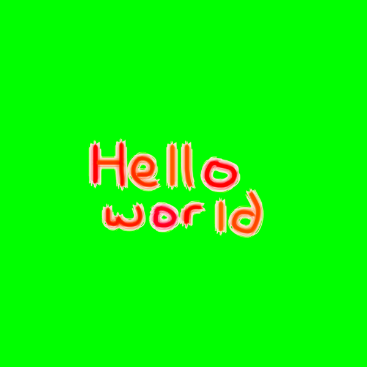
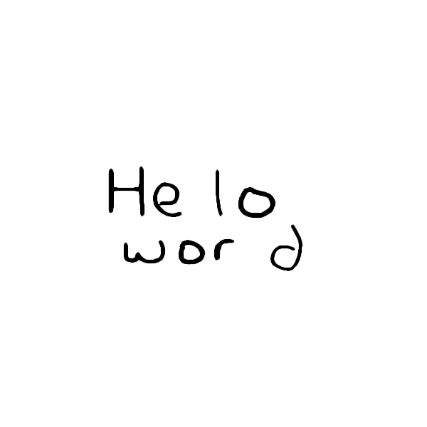
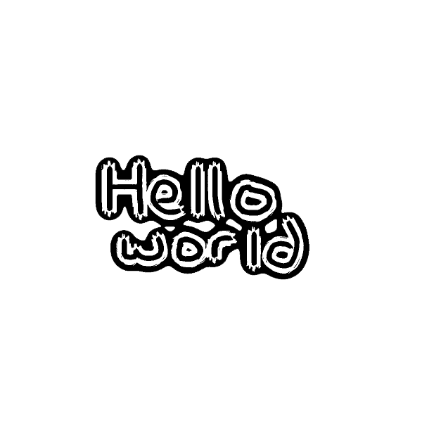

<div style="display: flex; justify-content: space-between; align-items: center; width: 100%;">
  <h1 style="margin: 0; padding: 0; font-size: 60px !important;">Smart Glasses</h1>
  
</div>

Smart glasses are wearable devices that combine traditional eyewear with advanced technology, integrating features like heads-up displays, cameras, microphones, and sensors. They enable users to access information, capture media, and interact with augmented reality or voice assistants seamlessly, all while keeping their hands free. Designed for both everyday and specialized use, smart glasses blend digital functionality with a familiar form factor.


| **Engineer** | **School** | **Area of Interest** | **Grade** |
|:--:|:--:|:--:|:--:|
| Gracin T | Los Gatos High | Electrical Engineering | Incoming Senior


<!-- -->
  
<!-- # Final Milestone

**Don't forget to replace the text below with the embedding for your milestone video. Go to Youtube, click Share -> Embed, and copy and paste the code to replace what's below.**

<iframe width="560" height="315" src="https://www.youtube.com/embed/F7M7imOVGug" title="YouTube video player" frameborder="0" allow="accelerometer; autoplay; clipboard-write; encrypted-media; gyroscope; picture-in-picture; web-share" allowfullscreen></iframe>

For your final milestone, explain the outcome of your project. Key details to include are:
- What you've accomplished since your previous milestone
- What your biggest challenges and triumphs were at BSE
- A summary of key topics you learned about
- What you hope to learn in the future after everything you've learned at BSE -->


# Second Milestone

## Progress
Since my last update, I’ve made significant technical progress that brings the Smart Glasses closer to being a functional assistive tool. I successfully installed TensorFlow 2 on the Raspberry Pi, which lays the foundation for implementing real-time object detection. I also integrated OCR (Optical Character Recognition) capabilities using adaptive thresholding, which dramatically improved text readability in various lighting conditions—a crucial step for reading signs, labels, or printed documents through the glasses.

## OCR
OCR, or Optical Character Recognition, is the process of converting images of text—such as signs, labels, or documents—into machine-encoded text that can be processed, stored, or read aloud.

### How it works
OCR works by analyzing an image and detecting patterns that resemble characters. The process typically involves several steps:

- Image Preprocessing – This includes converting the image to grayscale and applying thresholding to isolate the text from the background.

- Segmentation – The software identifies and separates lines, words, and characters.

- Feature Extraction – The program extracts distinct features of each character (like curves, lines, and intersections).

- Character Recognition – Using a trained model (often based on machine learning), the software compares extracted features to known characters.

- Post-Processing – Corrects errors based on context, like recognizing "1" instead of "I".

### Binary vs Adaptive Threshold
Thresholding is used to convert grayscale images into binary (black and white) images, which simplifies the text detection process.

Binary Thresholding uses a single global value. Pixels brighter than the threshold become white; darker pixels become black. This works well in consistent lighting but fails when the image has shadows or varying brightness.

Adaptive Thresholding calculates thresholds for small regions of the image. This means different areas of the image can have different threshold values, making it much more effective in uneven lighting conditions—like reading a sign outdoors with shadows.

## Sample Images

<table>
  <tr>
    <td></td>
    <td>This is the original image with red text on a green background.</td>
  </tr>
  <tr>
    <td></td>
    <td>This image shows a handwritten "Hello World" in black on a white background, likely a result of a binary threshold.</td>
  </tr>
  <tr>
    <td></td>
    <td>This image displays "Hello World" with a black outline and white fill, suggesting an adaptive threshold was applied.</td>
  </tr>
</table>

<iframe width="560" height="315" src="https://www.youtube.com/embed/y3VAmNlER5Y" 
    title="YouTube video player" frameborder="0" 
    allow="accelerometer; autoplay; clipboard-write; encrypted-media; gyroscope; picture-in-picture; web-share" 
    allowfullscreen>
  </iframe>

For your second milestone, explain what you've worked on since your previous milestone. You can highlight:
- Technical details of what you've accomplished and how they contribute to the final goal
- What has been surprising about the project so far
- Previous challenges you faced that you overcame
- What needs to be completed before your final milestone

## Code
Here's where you'll put your code. The syntax below places it into a block of code. Follow the guide [here]([url](https://www.markdownguide.org/extended-syntax/)) to learn how to customize it to your project needs. 

```c++
void setup() {
  // put your setup code here, to run once:
  Serial.begin(9600);
  Serial.println("Hello World!");
}

void loop() {
  // put your main code here, to run repeatedly:

}
```

# First Milestone - RasPI

<iframe width="560" height="315" src="https://www.youtube.com/embed/OAWN1qmHV5M?si=2GBFiyWOyTis4gh7" title="YouTube video player" frameborder="0" allow="accelerometer; autoplay; clipboard-write; encrypted-media; gyroscope; picture-in-picture; web-share" referrerpolicy="strict-origin-when-cross-origin" allowfullscreen></iframe>


## Progress
As I progress, I'll find more purposes for the Smart Glasses but as of right now, I want the glasses to be able to detect objects in front of them, read text, and take photos/videos that will be uploaded to either computer or web. So far, I've setup my Raspberry Pi and connected it to my computer via Tiger VNC. The main difficutly I had with Tiger VNC was the wifi. TigerVNC is a remote display system that allows you to control a computer's desktop from another device. It works by using a client-server model, where the server shares its screen and the client displays and controls it. TigerVNC utilizes the Remote Framebuffer protocol (RFB) to transmit screen updates and user input (keyboard and mouse) between the server and client. Essentially, I can remotely connect my laptop to the Pi without needing a nest of cables. Other than that, I just needed to plug in a bunch of cables.

## Schematics 

#### Raspberry Pi


# Bill of Materials
Here's where you'll list the parts in your project. To add more rows, just copy and paste the example rows below.
Don't forget to place the link of where to buy each component inside the quotation marks in the corresponding row after href =. Follow the guide [here]([url](https://www.markdownguide.org/extended-syntax/)) to learn how to customize this to your project needs. 

| **Part** | **Note** | **Price** | **Link** |
|:--:|:--:|:--:|:--:|
| Item Name | What the item is used for | $Price | <a href="https://www.amazon.com/Arduino-A000066-ARDUINO-UNO-R3/dp/B008GRTSV6/"> Link </a> |
| Item Name | What the item is used for | $Price | <a href="https://www.amazon.com/Arduino-A000066-ARDUINO-UNO-R3/dp/B008GRTSV6/"> Link </a> |
| Item Name | What the item is used for | $Price | <a href="https://www.amazon.com/Arduino-A000066-ARDUINO-UNO-R3/dp/B008GRTSV6/"> Link </a> |


# Starter Project: <a href="https://www.amazon.com/Classic-Electronic-Soldering-Tetris-Machine/dp/B07HB3HPPJ/ref=asc_df_B07HB3HPPJ?mcid=b00b7893f57d3a19abc2f6c187ac48cd&hvocijid=3301114880548506296-B07HB3HPPJ-&hvexpln=73&tag=hyprod-20&linkCode=df0&hvadid=721245378154&hvpos=&hvnetw=g&hvrand=3301114880548506296&hvpone=&hvptwo=&hvqmt=&hvdev=c&hvdvcmdl=&hvlocint=&hvlocphy=9032183&hvtargid=pla-2281435179498&th=1"> Retro Arcade Machine ($18.99) </a>


<iframe width="560" height="315" src="https://www.youtube.com/embed/U0qRxUKxOFM?si=1fMH9STmkVcjAm6f" title="YouTube video player" frameborder="0" allow="accelerometer; autoplay; clipboard-write; encrypted-media; gyroscope; picture-in-picture; web-share" referrerpolicy="strict-origin-when-cross-origin" allowfullscreen></iframe>

<!--- [](https://www.youtube.com/watch?v=U0qRxUKxOFM) --->

This starter project was designed to teach the fundamentals of soldering through hands-on assembly of a basic electronics kit. The kit allows you to build your own compact handheld gaming console featuring five classic LED-based games—including Tetris, Snake, racing, slot machine, and others—displayed on a 16×8 dot-matrix screen. It comes with a sturdy acrylic case, a buzzer with sound control, adjustable brightness, and score-tracking, and can be powered via USB or AAA batteries. Throughout the build process, I encountered several challenges, particularly with the numerous soldering joints required. The dot matrix display was especially tricky, as it contained a dense array of closely spaced connections. I frequently created unintended solder bridges between joints, which led to short circuits and required careful troubleshooting and rework to restore functionality. Ultimately, the project provided valuable practice in precision soldering and problem-solving when working with delicate electronic components.

Ideal for beginners, this starter project taught me soldering and general electric principles. 


<!-- # Other Resources/Examples
One of the best parts about Github is that you can view how other people set up their own work. Here are some past BSE portfolios that are awesome examples. You can view how they set up their portfolio, and you can view their index.md files to understand how they implemented different portfolio components.
- [Example 1](https://trashytuber.github.io/YimingJiaBlueStamp/)
- [Example 2](https://sviatil0.github.io/Sviatoslav_BSE/)
- [Example 3](https://arneshkumar.github.io/arneshbluestamp/)

To watch the BSE tutorial on how to create a portfolio, click here. -->
