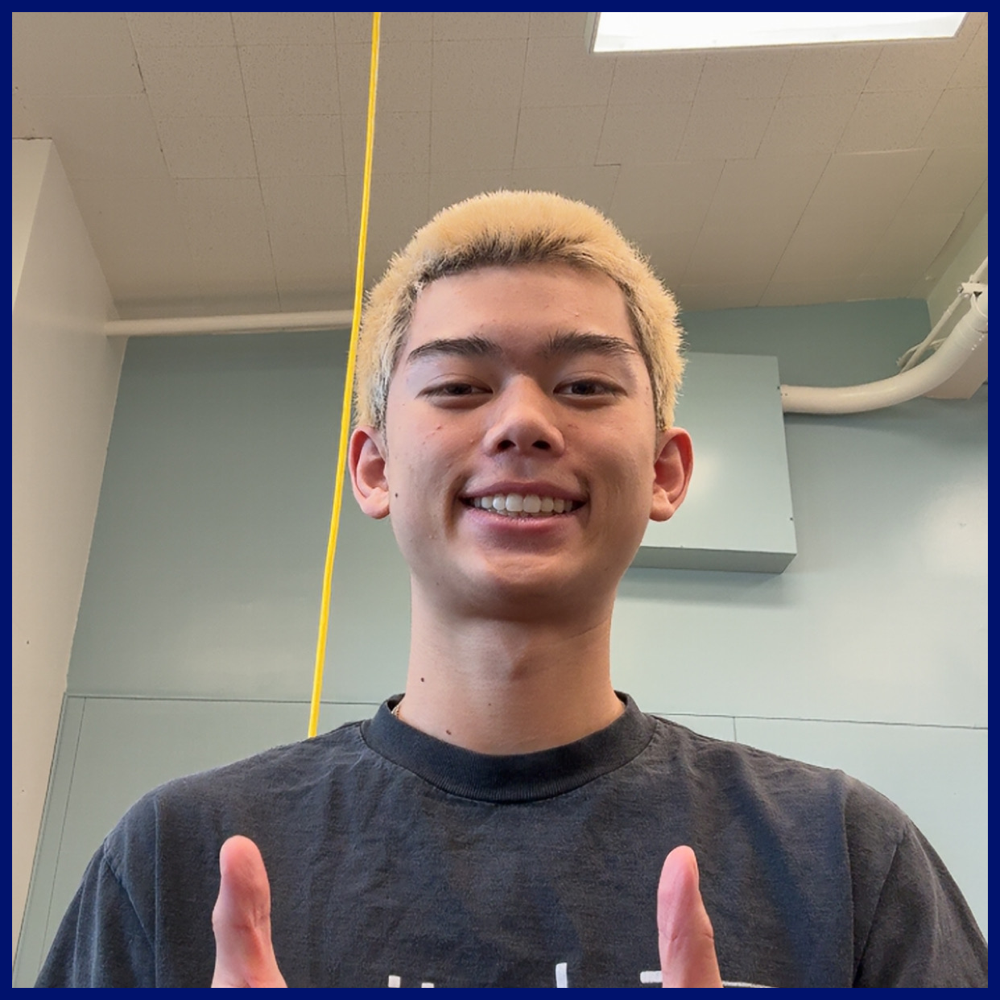
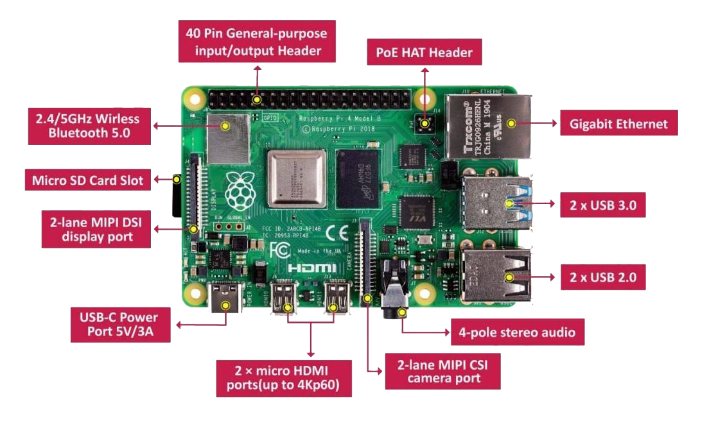
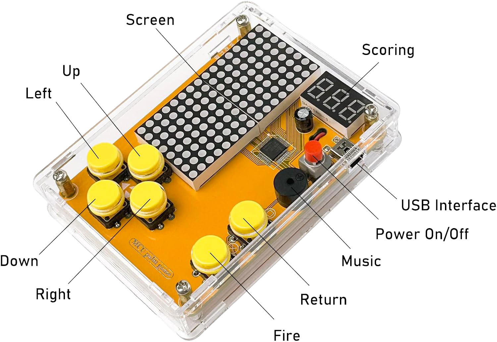
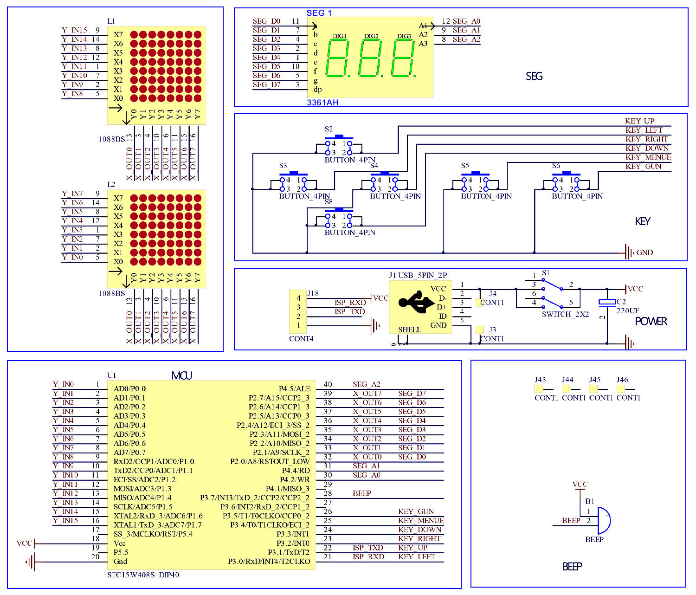

  <h1 style="margin: 0; padding: 0; font-size: 60px !important;">Smart Glasses</h1>
  

Smart glasses are wearable devices that combine traditional eyewear with advanced technology, integrating features like heads-up displays, cameras, microphones, and sensors. They enable users to access information, capture media, and interact with augmented reality or voice assistants seamlessly, all while keeping their hands free. Designed for both everyday and specialized use, smart glasses blend digital functionality with a familiar form factor.

| **Engineer** | **School** | **Area of Interest** | **Grade** |
|:--:|:--:|:--:|:--:|
| Gracin T | Los Gatos High | Electrical Engineering | Incoming Senior

<!-- -->
  
# Final Milestone

## Acomplishments
I've finally tied everything together. As of right now, the Pi is mounted onto my arm while the battery pack rests in my pocket. I've designed my own custom case for the Pi, which helps attatch to an arm band. In addition, I've designed my own custom clip for the camera to attatch to the glasses itself.

# Second Milestone

<iframe width="560" height="315" src="https://www.youtube.com/embed/TG-JziCimy0?si=8_uYgk6106NgsMs9" title="YouTube video player" frameborder="0" allow="accelerometer; autoplay; clipboard-write; encrypted-media; gyroscope; picture-in-picture; web-share" referrerpolicy="strict-origin-when-cross-origin" allowfullscreen></iframe>

## Progress
Since my last update, I’ve made significant technical progress that brings the Smart Glasses closer to being a functional assistive tool. I successfully installed TensorFlow 2 on the Raspberry Pi, which lays the foundation for implementing real-time object detection. I also integrated OCR (Optical Character Recognition) capabilities using adaptive thresholding, which dramatically improved text readability in various lighting conditions—a crucial step for reading signs, labels, or printed documents through the glasses.

## OCR
OCR, or Optical Character Recognition, is the process of converting images of text—such as signs, labels, or documents—into machine-encoded text that can be processed, stored, or read aloud.

### How it works
OCR works by analyzing an image and detecting patterns that resemble characters. The process typically involves several steps:

- Image Preprocessing – This includes converting the image to grayscale and applying thresholding to isolate the text from the background.

- Segmentation – The software identifies and separates lines, words, and characters.

- Feature Extraction – The program extracts distinct features of each character (like curves, lines, and intersections).

- Character Recognition – Using a trained model (often based on machine learning), the software compares extracted features to known characters.

- Post-Processing – Corrects errors based on context, like recognizing "1" instead of "I".

### Binary vs Adaptive Threshold
Thresholding is used to convert grayscale images into binary (black and white) images, which simplifies the text detection process.

Binary Thresholding uses a single global value. Pixels brighter than the threshold become white; darker pixels become black. This works well in consistent lighting but fails when the image has shadows or varying brightness.

Adaptive Thresholding calculates thresholds for small regions of the image. This means different areas of the image can have different threshold values, making it much more effective in uneven lighting conditions—like reading a sign outdoors with shadows.

---
layout: default
title: My Robotics Project Code
---

# My Robotics Project Code

This page showcases the core Python code for two major components of my robotics project: an Adaptive Thresholding with OCR Overlay application, and a MobileNetV2-based Real-time Object Detection Vision App.

---

## 1. Adaptive Threshold with OCR Overlay (Python)

This Python script demonstrates a real-time computer vision application using a Raspberry Pi camera (`picamera2`), OpenCV (`cv2`) for image processing, Tesseract OCR (`pytesseract`) for text detection, and `tkinter` for displaying the video feed with OCR results.

### Key Features:

* **Real-time Camera Feed:** Captures frames from a Raspberry Pi camera.
* **Grayscale Conversion & Adaptive Thresholding:** Processes frames to enhance text regions.
* **On-Demand OCR:** Toggles OCR execution with a key press ('t') to avoid continuous processing overhead.
* **OCR Overlay:** Draws bounding boxes and detected text directly onto the processed video feed.
* **Tkinter GUI:** Displays the processed video stream in a simple GUI window.

### How it Works:

The script continuously captures frames. When the 't' key is pressed, it triggers a one-time OCR analysis on the current frame. The detected text and its location are then displayed on subsequent frames until 't' is pressed again for a new scan. This allows for efficient, targeted text recognition without impacting the live video feed's performance excessively.

---

### Source Code: Adaptive Threshold with OCR

  <pre><code class="language-python">
import cv2
import numpy as np
from picamera2 import Picamera2
import pytesseract
from pytesseract import Output
from PIL import Image, ImageTk
import tkinter as tk
import time

# Initialize Picamera2
picam2 = Picamera2()
picam2.configure(picam2.create_preview_configuration(main={"format": "RGB888", "size": (640, 480)}))
picam2.start()

# Tkinter GUI setup
window = tk.Tk()
window.title("Adaptive Threshold with OCR Overlay")
label = tk.Label(window)
label.pack()

# Global flag to control OCR execution
# OCR will only run when this flag is True
ocr_enabled = False

# List to store the last OCR results for drawing
ocr_result = []

def on_key_press(event):
    """
    Callback function executed when a key is pressed.
    If the 'o' key is pressed, it sets the ocr_enabled flag to True.
    """
    global ocr_enabled
    if event.char == 't':
        ocr_enabled = True
        print("OCR enabled for next frame processing.")

def update_frame():
    """
    Captures a frame from the camera, processes it, and updates the display.
    OCR is performed only if the ocr_enabled flag is True.
    """
    global ocr_enabled, ocr_result

    # Capture a raw array frame from the camera
    frame = picam2.capture_array()

    start = time.time() # Start time for FPS calculation

    # Convert the frame to grayscale for processing
    gray = cv2.cvtColor(frame, cv2.COLOR_RGB2GRAY)

    # Apply adaptive thresholding to the grayscale image
    # This helps in isolating text regions
    thresh = cv2.adaptiveThreshold(gray, 255,
                                   cv2.ADAPTIVE_THRESH_GAUSSIAN_C,
                                   cv2.THRESH_BINARY,
                                   11, 2)
    # Convert the thresholded image back to BGR for color drawing
    thresh_color = cv2.cvtColor(thresh, cv2.COLOR_GRAY2BGR)

    # --- OCR Logic (now conditional on key press) ---
    if ocr_enabled:
        print("Performing OCR...")
        # Perform OCR on the thresholded image
        d = pytesseract.image_to_data(thresh, output_type=Output.DICT)
        
        # Clear previous OCR results before populating new ones
        ocr_result = []
        
        # Iterate through detected text and store confident results
        for i in range(len(d['text'])):
            # Check confidence level and ensure text is not empty
            if int(d['conf'][i]) > 60 and d['text'][i].strip() != "":
                ocr_result.append((d['text'][i], d['left'][i], d['top'][i], d['width'][i], d['height'][i]))
        
        # Reset the flag so OCR runs only once per 'o' key press
        ocr_enabled = False

    # --- Drawing OCR Results ---
    # Draw bounding boxes and text for the last OCR results (whether new or old)
    for (text, x, y, w, h) in ocr_result:
        # Draw a green rectangle around the detected text
        thresh_color = cv2.rectangle(thresh_color, (x, y), (x + w, y + h), (0, 255, 0), 1)
        # Put the detected text above the rectangle in red
        thresh_color = cv2.putText(thresh_color, text, (x, y - 10),
                                   cv2.FONT_HERSHEY_SIMPLEX, 0.5, (0, 0, 255), 2)

    # --- Display in Tkinter ---
    # Convert the OpenCV image (BGR) to RGB for PIL
    display_frame = cv2.cvtColor(thresh_color, cv2.COLOR_BGR2RGB)
    # Convert the numpy array image to a PIL Image
    img = Image.fromarray(display_frame)
    # Convert the PIL Image to a Tkinter PhotoImage
    imgtk = ImageTk.PhotoImage(image=img)
    
    # Update the Tkinter label with the new image
    label.imgtk = imgtk
    label.configure(image=imgtk)
    
    # Schedule the next frame update after 10 milliseconds
    window.after(10, update_frame)

    end = time.time() # End time for FPS calculation

    seconds = end - start
    print (f"Time taken : {seconds:.3f} seconds")
    
    # Calculate and print frames per second
    fps = 1 / seconds
    print(f"Estimated frames per second : {fps:.1f}")

# Bind the '<Key>' event to the on_key_press function.
# This means on_key_press will be called whenever any key is pressed.
window.bind('<Key>', on_key_press)

# Start the frame update loop
update_frame()
# Start the Tkinter event loop
window.mainloop()
  </code></pre>

---

## 2. MobileNetV2 Real-time Object Detection Vision App

This advanced Python application leverages a pre-trained MobileNetV2 model for real-time object detection using a Raspberry Pi camera. It features dynamic font sizing for detected objects, a toggle for detection, and speech output for persistent detections.

### Key Features:

* **Real-time Object Detection:** Utilizes MobileNetV2 to identify objects in the camera feed.
* **Configurable Camera Stream:** Integrates `picamera2` for efficient video capture.
* **Dynamic UI:** Resizes fonts and elements based on window size for responsiveness.
* **Toggleable Detection:** Pressing 'O' (or 'o') enables/disables object detection to manage resource usage.
* **Persistence Filtering:** Only reports objects that are consistently detected, reducing false positives.
* **Speech Output:** Announces detected objects using `festival` TTS if installed.
* **Performance Monitoring:** Displays real-time FPS and CPU temperature (on Raspberry Pi).

### How it Works:

The `VisionApp` class manages the camera, the MobileNetV2 model, and the Tkinter GUI. It continuously fetches frames, and if detection is enabled, it feeds them to the model for inference. Detected objects are then displayed on the screen with text and confidence levels. A history of `last_seen` objects helps filter out fleeting detections, ensuring only persistent objects trigger an audio announcement.

---

### Source Code: MobileNetV2 Vision App

  <pre><code class="language-python">
# SPDX-FileCopyrightText: 2021 Limor Fried/ladyada for Adafruit Industries
# SPDX-FileCopyrightText: 2021 Melissa LeBlanc-Washington for Adafruit Industries
#
# SPDX-License-Identifier: MIT

import time
import logging
import argparse
import os
import subprocess
import sys
import numpy as np
import signal
import tkinter as tk
from tkinter import font
from PIL import Image, ImageTk, ImageOps

# Suppress PIL's INFO messages
logging.getLogger('PIL').setLevel(logging.WARNING)

CONFIDENCE_THRESHOLD = 0.5    # at what confidence level do we say we detected a thing
PERSISTANCE_THRESHOLD = 0.25  # what percentage of the time we have to have seen a thing

def dont_quit(signal_num, frame):
    """Signal handler to prevent quitting on SIGHUP."""
    print(f'Caught signal: {signal_num}')
signal.signal(signal.SIGHUP, dont_quit)

# App components (assuming these are installed or available)
try:
    from rpi_vision.agent.capturev2 import PiCameraStream
    from rpi_vision.models.mobilenet_v2 import MobileNetV2Base
except ImportError:
    logging.error("rpi_vision library not found. Please ensure it's installed.")
    logging.error("You might need to install it: pip install rpi_vision")
    sys.exit(1)

logging.basicConfig()
logging.getLogger().setLevel(logging.INFO)

class VisionApp:
    def __init__(self, args):
        self.args = args
        self.root = tk.Tk()
        self.root.title("MobileNetV2 Vision App")

        self.root.geometry(f"{int(self.root.winfo_screenwidth() * 0.8)}x{int(self.root.winfo_screenheight() * 0.8)}")
        self.root.geometry("800x600")

        # Create a canvas to display the video feed and overlays
        self.canvas = tk.Canvas(self.root, bg="black", highlightthickness=0)
        self.canvas.pack(fill=tk.BOTH, expand=True)

        self.capture_manager = None
        self.model = None
        self.last_seen = [None] * 10
        self.last_spoken = None
        self.detection_enabled = False #  Initial state for detection

        self.init_fonts()
        self.load_splash_screen()

        self.root.bind("<Configure>", self.on_resize)
        self.root.bind("o", self.toggle_detection)
        self.root.bind("O", self.toggle_detection)

        self.root.update_idletasks() # Ensure window dimensions are updated before camera init

        self.init_camera_and_model()

        # Start the update loop
        self.update_frame()

        # Handle window close event
        self.root.protocol("WM_DELETE_WINDOW", self.on_closing)

    def init_fonts(self):
        """Initializes Tkinter fonts based on screen resolution."""
        # Scale font sizes relative to current canvas height for better responsiveness
        # We'll re-evaluate these on resize if needed, but for initial setup, use screen height
        canvas_height = self.root.winfo_screenheight() # Use screen height for initial font sizing
        self.smallfont = font.Font(family="Helvetica", size=int(canvas_height * 0.02))
        self.medfont = font.Font(family="Helvetica", size=int(canvas_height * 0.03))
        self.bigfont = font.Font(family="Helvetica", size=int(canvas_height * 0.04))
        # New: Font for detection status
        self.statusfont = font.Font(family="Helvetica", size=int(canvas_height * 0.025), weight="bold")

    def on_resize(self, event):
        """Handles window resizing to adjust font sizes and redraw content."""
        # Only update if the canvas size has actually changed
        if self.canvas.winfo_width() != self.current_canvas_width or \
           self.canvas.winfo_height() != self.current_canvas_height:
            self.current_canvas_width = self.canvas.winfo_width()
            self.current_canvas_height = self.canvas.winfo_height()
            self.init_fonts() # Re-initialize fonts based on new canvas size
            # No need to call update_frame here, it will be called by root.after

    def load_splash_screen(self):
        """Loads and displays a splash screen."""
        try:
            splash_path = os.path.join(os.path.dirname(sys.argv[0]), 'bchatsplash.bmp')
            if not os.path.exists(splash_path):
                logging.warning(f"Splash screen not found at {splash_path}. Skipping splash.")
                # Create a simple black background if splash is not found
                self.canvas.create_rectangle(0, 0, self.canvas.winfo_width(), self.canvas.winfo_height(), fill="black")
                self.canvas.create_text(self.canvas.winfo_width() / 2, self.canvas.winfo_height() / 2,
                                         text="Loading...", fill="white", font=self.bigfont)
                self.root.update()
                return

            splash_img = Image.open(splash_path)

            # Rotate the splash image if specified
            if self.args.rotation != 0:
                splash_img = splash_img.rotate(self.args.rotation, expand=True)

            # Scale the image to fit the smaller dimension of the current canvas, maintaining aspect ratio
            img_width, img_height = splash_img.size
            canvas_width = self.canvas.winfo_width()
            canvas_height = self.canvas.winfo_height()

            scale_factor = min(canvas_width / img_width, canvas_height / img_height)
            new_width = int(img_width * scale_factor)
            new_height = int(img_height * scale_factor)
            splash_img = splash_img.resize((new_width, new_height), Image.Resampling.LANCZOS)

            self.tk_splash_img = ImageTk.PhotoImage(splash_img)

            # Center the image on the canvas
            self.canvas.create_image(canvas_width / 2, canvas_height / 2,
                                      image=self.tk_splash_img, anchor=tk.CENTER)
            self.root.update() # Update the display to show splash screen
        except Exception as e:
            logging.error(f"Error loading or displaying splash screen: {e}")
            self.canvas.create_rectangle(0, 0, self.canvas.winfo_width(), self.canvas.winfo_height(), fill="black")
            self.canvas.create_text(self.canvas.winfo_width() / 2, self.canvas.winfo_height() / 2,
                                     text="Loading...", fill="white", font=self.bigfont)
            self.root.update()

    def init_camera_and_model(self):
        """Initializes the camera stream and the MobileNetV2 model."""
        try:
            # --- MODIFICATION START ---
            # Define your desired resolution here. Common smaller resolutions are:
            # (640, 480), (320, 240), (160, 120)
            # Choose a resolution that suits your needs.
            desired_resolution = (320, 240) # Example: VGA resolution

            self.capture_manager = PiCameraStream(preview=False, resolution=desired_resolution)
            # --- MODIFICATION END ---
            self.capture_manager.start()
            # Wait a bit for the camera to warm up and get the first frame
            time.sleep(2)

            # Ensure camera resolution is available
            if not self.capture_manager.resolution:
                raise RuntimeError("Failed to get camera resolution from PiCameraStream.")

            self.model = MobileNetV2Base(include_top=self.args.include_top)
            logging.info("Camera and model initialized successfully.")

            # Initialize current canvas dimensions for resize tracking
            self.current_canvas_width = self.canvas.winfo_width()
            self.current_canvas_height = self.canvas.winfo_height()

        except Exception as e:
            logging.error(f"Failed to initialize camera or model: {e}")
            self.on_closing() # Close the app if initialization fails

    def toggle_detection(self, event=None):
        """Toggles the object detection functionality on and off."""
        self.detection_enabled = not self.detection_enabled
        logging.info(f"Object detection is now {'ENABLED' if self.detection_enabled else 'DISABLED'}")
        if not self.detection_enabled:
            # Clear last seen objects and spoken text when detection is turned off
            self.last_seen = [None] * 10
            self.last_spoken = None

    def update_frame(self):
        """
        Reads a frame from the camera, performs inference (if enabled), and updates the Tkinter canvas.
        This function is called periodically.
        """
        if self.capture_manager is None or self.capture_manager.stopped:
            self.root.after(100, self.update_frame) # Try again soon if not ready
            return

        frame_raw = self.capture_manager.read()
        if frame_raw is None:
            self.root.after(10, self.update_frame) # Try again soon
            return

        # Get current canvas dimensions
        canvas_width = self.canvas.winfo_width()
        canvas_height = self.canvas.winfo_height()

        # Clear previous drawings on the canvas
        self.canvas.delete("all")
        self.canvas.create_rectangle(0, 0, canvas_width, canvas_height, fill="black")

        # Convert numpy array to PIL Image
        pil_img = Image.fromarray(self.capture_manager.frame)

        # Apply rotation if specified
        if self.args.rotation != 0:
            pil_img = pil_img.rotate(self.args.rotation, expand=True)

        # Resize the PIL image to fit the current canvas, maintaining aspect ratio
        img_width, img_height = pil_img.size

        # Calculate scale factor to fit the image within the canvas dimensions
        if img_width > 0 and img_height > 0: # Avoid division by zero
            scale_factor = min(canvas_width / img_width, canvas_height / img_height)
        else:
            scale_factor = 1.0 # Default if image has no dimensions

        new_width = int(img_width * scale_factor)
        new_height = int(img_height * scale_factor)

        # Ensure dimensions are at least 1x1
        new_width = max(1, new_width)
        new_height = max(1, new_height)

        pil_img = pil_img.resize((new_width, new_height), Image.Resampling.LANCZOS)

        # Convert PIL Image to Tkinter PhotoImage
        self.tk_img = ImageTk.PhotoImage(pil_img)

        # Center the image on the canvas
        self.canvas.create_image(canvas_width / 2, canvas_height / 2,
                                  image=self.tk_img, anchor=tk.CENTER)

        timestamp = time.monotonic()

        # Display detection status
        status_text = "Detection: " + ("ON" if self.detection_enabled else "OFF")
        status_color = "green" if self.detection_enabled else "red"
        self.canvas.create_text(10, 10, text=status_text, fill=status_color,
                                 font=self.statusfont, anchor=tk.NW)

        if self.detection_enabled and self.model: # Only run detection if enabled and model is initialized
            if self.args.tflite:
                prediction = self.model.tflite_predict(frame_raw)[0]
            else:
                prediction = self.model.predict(frame_raw)[0]
            delta = time.monotonic() - timestamp
            logging.info("%s inference took %d ms, %0.1f FPS" % ("TFLite" if self.args.tflite else "TF", delta * 1000, 1 / delta))
            # print(self.last_seen) # For debugging

            # Add FPS & temp on top corner of image
            fpstext = "%0.1f FPS" % (1/delta,)
            self.canvas.create_text(canvas_width - 10, 10, text=fpstext, fill="red",
                                     font=self.smallfont, anchor=tk.NE)
            try:
                temp = int(open("/sys/class/thermal/thermal_zone0/temp").read()) / 1000
                temptext = f"{temp:.0f}°C"
                self.canvas.create_text(canvas_width - 10, 30, text=temptext, fill="red",
                                         font=self.smallfont, anchor=tk.NE)
            except OSError:
                pass # Not on a Raspberry Pi or thermal zone not found

            detected_something = False
            for p in prediction:
                label, name, conf = p
                if conf > CONFIDENCE_THRESHOLD:
                    detected_something = True
                    logging.info(f"Detected: {name} (Confidence: {conf:.2f})")

                    persistant_obj = False
                    self.last_seen.append(name)
                    self.last_seen.pop(0)

                    inferred_times = self.last_seen.count(name)
                    if inferred_times / len(self.last_seen) > PERSISTANCE_THRESHOLD:
                        persistant_obj = True

                    detecttext = name.replace("_", " ")
                    detecttext_font = self.smallfont # Default
                    # Find the largest font that fits
                    for f in (self.bigfont, self.medfont, self.smallfont):
                        text_width = f.measure(detecttext)
                        if text_width < canvas_width * 0.9: # Allow some margin
                            detecttext_font = f
                            break

                    detecttext_color = "green" if persistant_obj else "white"
                    # Position at the bottom center of the screen
                    text_y_position = canvas_height - detecttext_font.metrics("linespace") - 10
                    self.canvas.create_text(canvas_width // 2, text_y_position,
                                             text=detecttext, fill=detecttext_color,
                                             font=detecttext_font, anchor=tk.S)

                    if persistant_obj and self.last_spoken != detecttext:
                        try:
                            subprocess.Popen(f"echo '{detecttext}' | festival --tts &", shell=True)
                            self.last_spoken = detecttext
                        except FileNotFoundError:
                            logging.warning("Festival TTS not found. Please install it if you want speech output.")
                        except Exception as e:
                            logging.error(f"Error calling festival TTS: {e}")
                        break # Only show the highest confidence detection

            if not detected_something:
                self.last_seen.append(None)
                self.last_seen.pop(0)
                if all(item is None for item in self.last_seen):
                    self.last_spoken = None
        elif not self.detection_enabled:
            # Optionally display a message that detection is off
            self.canvas.create_text(canvas_width // 2, canvas_height // 2,
                                     text="Object Detection OFF (Press 'O' to enable)",
                                     fill="white", font=self.medfont, anchor=tk.CENTER)
            # Clear any persistent detection data if detection is off
            self.last_seen = [None] * 10
            self.last_spoken = None

        # Schedule the next update
        self.root.after(10, self.update_frame) # Update every 10 milliseconds (approx 100 FPS)

    def on_closing(self):
        """Handles the window closing event, stopping the camera stream."""
        logging.info("Closing application...")
        if self.capture_manager:
            self.capture_manager.stop()
        self.root.destroy()
        sys.exit(0) # Ensure the script exits cleanly

    def run(self):
        """Starts the Tkinter event loop."""
        self.root.mainloop()

def parse_args():
    """Parses command line arguments."""
    parser = argparse.ArgumentParser()
    parser.add_argument('--include-top', type=bool,
                        dest='include_top', default=True,
                        help='Include fully-connected layer at the top of the network.')

    parser.add_argument('--tflite',
                        dest='tflite', action='store_true', default=False,
                        help='Convert base model to TFLite FlatBuffer, then load model into TFLite Python Interpreter')

    parser.add_argument('--rotation', type=int, choices=[0, 90, 180, 270],
                        dest='rotation', action='store', default=0,
                        help='Rotate everything on the display by this amount (0, 90, 180, 270 degrees).')
    args = parser.parse_args()
    return args

if __name__ == "__main__":
    args = parse_args()
    app = VisionApp(args)
    try:
        app.run()
    except KeyboardInterrupt:
        app.on_closing()
    except Exception as e:
        logging.error(f"An unhandled error occurred: {e}")
        if app.capture_manager:
            app.capture_manager.stop()
        sys.exit(1)
  </code></pre>

## Object Detection Challenges
Developing the object detection code presented several hurdles for me, especially getting it to run smoothly on a Raspberry Pi.

Firstly, real-time performance was a constant battle. Running a deep learning model like MobileNetV2 on such a small device is incredibly demanding. I struggled to get a decent frame rate, even with optimizations like the tflite option. It was a fine line between fast inference and acceptable accuracy, and managing the Pi's limited CPU and memory to prevent crashes or freezes was always on my mind. Making sure the camera stream started and stopped cleanly without hogging resources was also a recurring challenge.

Then there was the Tkinter user interface and video integration. Getting that live camera feed to display without stuttering was tricky. I used root.after to schedule updates, but timing it perfectly with the camera's frame rate and the model's processing time took a lot of tweaking. Plus, I wanted the display to be responsive, so making the video and any overlays (like detection text) scale correctly when the window was resized was a complex task. Adjusting font sizes dynamically based on the window size was a good solution, but getting those calculations just right so the text always fit and was readable required careful attention.

I also spent a lot of time fine-tuning the robustness of the detection logic. Those CONFIDENCE_THRESHOLD and PERSISTANCE_THRESHOLD values were critical. Too low, and I'd get a flurry of false positives; too high, and detections would flicker or be missed entirely. The "persistence" logic helped stabilize things, but finding that sweet spot for PERSISTANCE_THRESHOLD was definitely an iterative process of trial and error. And when nothing was detected, I had to ensure the last_seen list and last_spoken state cleared properly, so the system didn't keep announcing phantom objects.

Finally, dealing with external dependencies and environment setup added its own layer of complexity. Relying on a custom rpi_vision library meant I had to ensure it was correctly installed and compatible with my specific Raspberry Pi setup. Integrating festival --tts for speech output involved dealing with subprocess.Popen and handling potential FileNotFoundError issues, which just added more points of failure to manage.

## OCR Challenges
My experience with the OCR code brought its own set of unique difficulties.

One of the biggest headaches was image preprocessing for OCR. Getting the cv2.adaptiveThreshold parameters right was crucial. Different lighting, text sizes, or even paper types meant constantly tweaking those block size and constant C values. Sometimes I even considered adding more preprocessing steps like blurring or morphological operations to improve accuracy, but that would just add more computational overhead. Choosing the (640, 480) resolution was a compromise between getting clear enough text and not completely bogging down the Pi's performance.

Then there was the sheer accuracy and limitations of Pytesseract itself. It's fantastic for clear, printed text, but I quickly learned its limitations with different fonts, especially anything handwritten or highly stylized. And if the document had a complex layout, Pytesseract could really struggle with identifying text blocks correctly. I also had to play around with the confidence threshold for detected text; too high and I'd miss valid text, too low and I'd get a lot of junk.

Real-time OCR performance was the most significant hurdle here. I quickly realized that running pytesseract.image_to_data on every single frame would kill the frame rate and make the application completely unusable. That's why I implemented the ocr_enabled flag and the 't' key press trigger – it was my way of letting the user decide when to run OCR, rather than trying to do it continuously. If I had to do continuous OCR, I'd need a completely different strategy, perhaps processing only every Nth frame or looking into dedicated hardware accelerators.

Finally, the integration with Tkinter and OpenCV brought its usual share of pain points. Converting images between NumPy arrays (OpenCV), PIL Images, and Tkinter PhotoImages always required careful attention, especially getting the color channels right (BGR to RGB). And drawing those bounding boxes and text overlays on the OpenCV image meant I had to precisely map coordinates, which could get tricky if the image was resized for display.

Overall, both projects really highlighted the common challenges of real-time computer vision on embedded systems. It's a constant balancing act of performance, accuracy, and user experience, with a lot of parameter tuning, error handling, and wrestling with external libraries along the way.

# First Milestone - RasPI

<iframe width="560" height="315" src="https://www.youtube.com/embed/OAWN1qmHV5M?si=2GBFiyWOyTis4gh7" title="YouTube video player" frameborder="0" allow="accelerometer; autoplay; clipboard-write; encrypted-media; gyroscope; picture-in-picture; web-share" referrerpolicy="strict-origin-when-cross-origin" allowfullscreen></iframe>

## Summary
My project revolves around developing Smart Glasses with various functionalities. Currently, my primary goals for the glasses are object detection, text reading (OCR), and the ability to capture photos/videos for upload to a computer or the web. To get started, I've successfully set up my Raspberry Pi and established a remote connection to it using TigerVNC. This remote display system, which operates on a client-server model using the Remote Framebuffer (RFB) protocol, allows me to control the Pi's desktop from my laptop, effectively eliminating the need for a tangle of physical cables.

## Challenges

The main difficulty I encountered during the initial setup was specifically with TigerVNC and its reliance on Wi-Fi. Establishing and maintaining a stable, performant Wi-Fi connection for the remote desktop proved to be the primary hurdle. Beyond that, the setup largely involved straightforward cable connections.

## Schematics 

#### Raspberry Pi

<a href="https://www.amazon.com/seeed-studio-Raspberry-Computer-Workstation/dp/B07WBZM4K9"> Link </a>

# Bill of Materials
Here's where you'll list the parts in your project. To add more rows, just copy and paste the example rows below.
Don't forget to place the link of where to buy each component inside the quotation marks in the corresponding row after href =. Follow the guide [here]([url](https://www.markdownguide.org/extended-syntax/)) to learn how to customize this to your project needs. 

| **Part** | **Note** | **Price** | **Link** |
|:--:|:--:|:--:|:--:|
| RaspberryPi 4 model B kit | Includes Raspberry Pi 4 4GB Model B with 1.5GHz 64-bit quad-core CPU (4GB RAM). Includes Pre-Loaded 32GB EVO+ Micro SD Card (Class 10), USB MicroSD Card Reader. CanaKit Premium High-Gloss Raspberry Pi 4 Case with Integrated Fan Mount, CanaKit Low Noise Bearing System Fan. CanaKit 3.5A USB-C Raspberry Pi 4 Power. Supply (US Plug) with Noise Filter, Set of Heat Sinks, Display Cable - 6 foot (Supports up to 4K60p). CanaKit USB-C PiSwitch (On/Off Power Switch for Raspberry Pi 4) | $119.99 | <a href="https://www.amazon.com/CanaKit-Raspberry-4GB-Starter-Kit/dp/B07V5JTMV9/ref=sr_1_1?dib=eyJ2IjoiMSJ9.Xksc4QMnpl0XTxlxg-mR1l-LRepignyGXtdycKSCy1zH3TofbLnnDyvhzEkm3qCQFKqWFnb_B6lg5TjnoWBa7SDh0j3fnHn341W9RowXBbD79pFmzFR87S_95JkIG9v_be2VcMpIcZBAQdALpdI6p2rvVNP6xx_vyfJFr-6t7JWrpvH83xXrZ-zhWDRh7WUBYLmIvtQ31BStXOR83C7lEnlXnN56lF-Yd4c4I8Nzk-Y.N_5m7gZwFLjKuNoCDSVDeAxPcwoq5sGhuWRbEqoUobE&dib_tag=se&keywords=canakit%2Braspberry%2Bpi%2B4%2Bmodel%2Bb&qid=1751570356&sr=8-1&th=1"> Link </a> |
| Item Name | What the item is used for | $Price | <a href="https://www.amazon.com/Arduino-A000066-ARDUINO-UNO-R3/dp/B008GRTSV6/"> Link </a> |
| Item Name | What the item is used for | $Price | <a href="https://www.amazon.com/Arduino-A000066-ARDUINO-UNO-R3/dp/B008GRTSV6/"> Link </a> |

# Starter Project: <a href="https://www.amazon.com/Classic-Electronic-Soldering-Tetris-Machine/dp/B07HB3HPPJ/ref=asc_df_B07HB3HPPJ?mcid=b00b7893f57d3a19abc2f6c187ac48cd&hvocijid=3301114880548506296-B07HB3HPPJ-&hvexpln=73&tag=hyprod-20&linkCode=df0&hvadid=721245378154&hvpos=&hvnetw=g&hvrand=3301114880548506296&hvpone=&hvptwo=&hvqmt=&hvdev=c&hvdvcmdl=&hvlocint=&hvlocphy=9032183&hvtargid=pla-2281435179498&th=1"> Retro Arcade Machine</a>

<iframe width="560" height="315" src="https://www.youtube.com/embed/U0qRxUKxOFM?si=1fMH9STmkVcjAm6f" title="YouTube video player" frameborder="0" allow="accelerometer; autoplay; clipboard-write; encrypted-media; gyroscope; picture-in-picture; web-share" referrerpolicy="strict-origin-when-cross-origin" allowfullscreen></iframe>

<!---  --->

This starter project was designed to teach the fundamentals of soldering through hands-on assembly of a basic electronics kit. The kit allows you to build your own compact handheld gaming console featuring five classic LED-based games—including Tetris, Snake, racing, slot machine, and others—displayed on a 16×8 dot-matrix screen. It comes with a sturdy acrylic case, a buzzer with sound control, adjustable brightness, and score-tracking, and can be powered via USB or AAA batteries. Throughout the build process, I encountered several challenges, particularly with the numerous soldering joints required. The dot matrix display was especially tricky, as it contained a dense array of closely spaced connections. I frequently created unintended solder bridges between joints, which led to short circuits and required careful troubleshooting and rework to restore functionality. Ultimately, the project provided valuable practice in precision soldering and problem-solving when working with delicate electronic components.

Ideal for beginners, this starter project taught me soldering and general electric principles. 

<a href="https://www.amazon.com/Classic-Electronic-Soldering-Tetris-Machine/dp/B07HB3HPPJ?th=1"> Link </a>

<a href="https://www.amazon.ae/Gxcdizx-Hand-held-Practise-Soldering-Electronics/dp/B0851HFNYM"> Link </a>

<!-- # Other Resources/Examples
One of the best parts about Github is that you can view how other people set up their own work. Here are some past BSE portfolios that are awesome examples. You can view how they set up their portfolio, and you can view their index.md files to understand how they implemented different portfolio components.
- [Example 1](https://trashytuber.github.io/YimingJiaBlueStamp/)
- [Example 2](https://sviatil0.github.io/Sviatoslav_BSE/)
- [Example 3](https://arneshkumar.github.io/arneshbluestamp/)

To watch the BSE tutorial on how to create a portfolio, click here. -->
